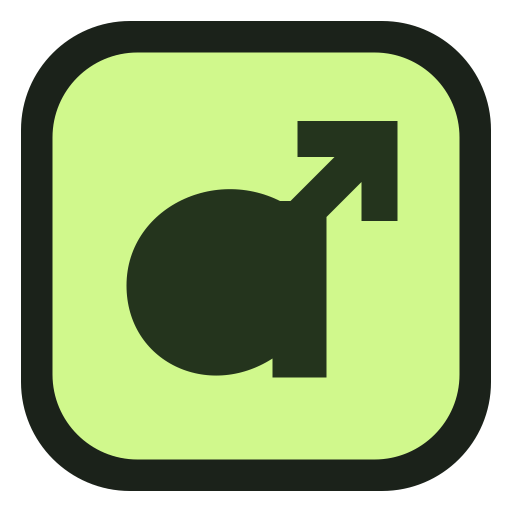
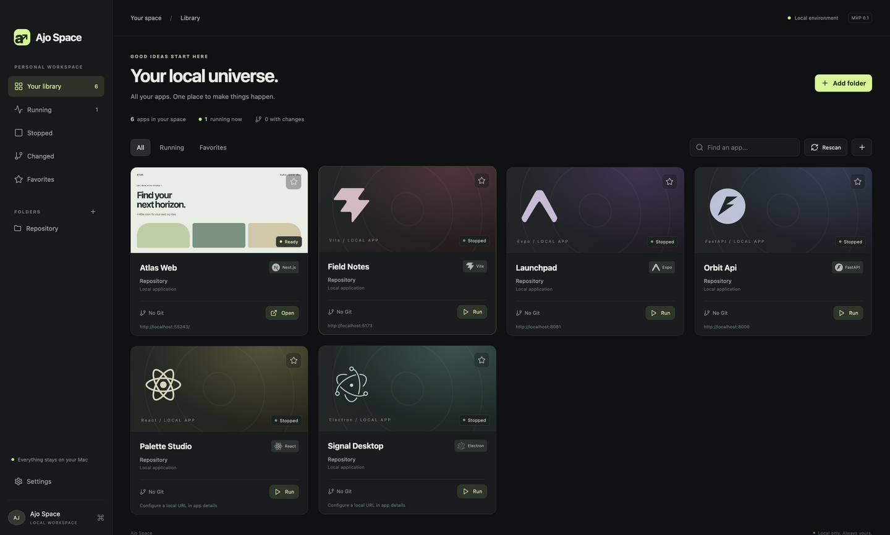

<div align="center">
  
  <h1>Ajo Space</h1>
  <p><strong>Your local repositories. One glance.</strong></p>
  <p>A local-first desktop library to discover, run, and monitor your apps—without juggling folders and terminals.</p>
  <p>macOS · Electron · React · TypeScript · MIT</p>
</div>



## What it does

Ajo Space turns a folder of repositories into a visual app library. It finds runnable apps inside nested projects, shows their Git and runtime status, and gives you a place to launch them, inspect logs, and open their local URLs.

A repository can contain several apps. A folder can contain no apps. Ajo Space looks for runnable evidence instead of assuming **one folder = one app**.

```text
~/Repository/
├── storefront/                 → Next.js app
├── design-experiments/
│   └── checkout/
│       └── prototype/          → nested Vite app
└── processing-service/         → Python web app
```

## Get started

**Requirements:** macOS, Git, Node.js 22.12 or newer (24 recommended), and npm. Each project you launch still needs its own dependencies and language runtime installed.

```sh
git clone https://github.com/albertjohannes-id/ajo-space.git
cd ajo-space
npm ci
npm run dev
```

1. **Name your space.** On first launch, choose a workspace name (up to 32 characters) and an optional emoji or initials badge. Choose **Use Ajo Space** to keep **Ajo Space / AJ**. Rename it anytime in **Settings → Your workspace**.
2. **Add a folder**, such as `~/Repository`. Scanning reads project files; it does not launch apps or install their dependencies.
3. **Select an app** and check its command, working directory, port and URL. Edit any values that need adjusting.
4. **Run**, wait for **Ready**, then **Open**. Ajo Space captures and saves a preview automatically.
5. **Stop** or **Restart** managed apps from their detail page. Closing Ajo Space stops apps it launched.

### Build a normal macOS app

```sh
npm run package
```

On Apple Silicon, open `release/mac-arm64/Ajo Space.app` or copy it into your Applications folder. Output follows the host architecture. The app has a dedicated icon; signing and notarization are not configured yet. Rebuilding source does not update a previously installed copy automatically.

## Your library at a glance

| Feature             | Behavior                                                                                           |
| ------------------- | -------------------------------------------------------------------------------------------------- |
| Recursive discovery | Finds direct and nested runnable apps, preserving their parent context                             |
| Framework logos     | Bundled offline marks for supported languages and frameworks                                       |
| Run controls        | Run, Stop, Restart and Open; bounded live stdout/stderr logs                                       |
| External apps       | Identifies Terminal-launched web apps when the configured port and process working directory match |
| Git details         | Branch, dirty files, ahead/behind, effective Git identity and remote                               |
| Commit history      | Expandable full messages, authors, dates, hashes and older-history pagination                      |
| Visual previews     | Automatic capture when ready, with manual Refresh preview                                          |
| Organization        | Search, Running, Stopped, Changed and Favorites                                                    |
| Overrides           | Rename, hide, mark as an app/not an app, exclude folder trees, customize launch configuration      |
| Native actions      | Open an editor, Terminal or Finder; copy paths and URLs                                            |
| Personalization     | Workspace name and emoji/initials badge, appearance, editor and scan preferences                   |

### Supported discovery

- Node projects with `dev`, `start` or `serve` scripts; npm, pnpm, Yarn and Bun lockfile detection.
- Next.js, Vite, React, Expo and Electron identification from dependencies.
- FastAPI and Django entry points, plus common Python scripts. Existing `.venv` or `venv` interpreters take priority over system Python.
- Go executables, Rust binary targets, Docker Compose files and static HTML apps.

Detection is a starting point, not a universal build-system parser. If a project needs a custom command, port or working directory, edit its configuration. Generated folders, hidden trees and directory symlinks are skipped. Folder names alone never establish that a project is runnable.

## What the statuses mean

- **Stopped:** no managed process or identified external service.
- **Starting:** launched by Ajo Space and waiting for its expected listener.
- **Ready:** the managed app's port responds. Commands without a known port use process liveness instead.
- **Error:** the managed command failed; inspect its logs.
- **Running Externally:** a matching listener was started outside Ajo Space. Open and previews work, but Stop and Restart stay unavailable.

A busy port alone does not make every app using that port “running.” Ajo Space checks ownership. Unknown ports, ambiguous directories and Docker-hosted listeners may prevent external detection. TCP readiness is not a full application-health check.

## Git: changes, commits and pushes

**Changed** means uncommitted Git changes: staged, unstaged and untracked files. This view sorts the most recently edited projects first. Deleted-file timestamps are approximate; a recent commit in a clean repository does not qualify. Git refreshes about every 30 seconds or on **Rescan**. Other views stay alphabetical.

**Commit history** shows the current branch's latest 20 commits, with older-history pagination (up to 5,020 entries). Expand a commit for its full message/comment, author, timestamps, hash, decorations and cached-upstream comparison.

**Last recorded push** uses an explicit push event from the current upstream's local reflog. It can be unavailable after cloning, reflog expiry or pushes from another machine. It is not a server audit log. The upstream card's commit date is never presented as a push timestamp. Reading history does not fetch or push anything.

## Local data and privacy

No product account, analytics, telemetry, backend service or cloud sync is required. The public app contains no hardcoded personal workspace, user directory, email or private project screenshot.

| Data                                           | Location                                                  |
| ---------------------------------------------- | --------------------------------------------------------- |
| Workspace profile, settings and cached library | `~/Library/Application Support/Ajo Space/`                |
| Per-app preview and metadata                   | `<git-root>/.ajo-space/previews/<app-id>.png` and `.json` |
| Preview for a non-Git project                  | `<app-path>/.ajo-space/previews/`                         |
| Fallback preview cache                         | Application data's `previews/` folder                     |
| Process logs                                   | Memory only; last 100 KB per app for the current session  |

Your real repository metadata and logs are displayed locally because they are the purpose of this tool. Previews can contain private data: review them before sharing or committing a project. Ajo Space excludes generated `.ajo-space` files from its own Changed view but does not modify your `.gitignore`. Add `.ajo-space/` to your project's ignore rules if you do not want previews in Git.

The screenshot above uses only synthetic demo projects. Read [security and privacy](SECURITY.md) for trust boundaries and limitations.

## Development and documentation

```sh
npm test              # Filesystem, Git, runtime and workspace-profile tests
npm run build         # Type checks and production renderer build
npm run test:previews # Capture and repository-persistence integration tests
npm run test:desktop  # Electron UI smoke test with isolated fixtures
npm run package       # Unsigned macOS application
```

- [AI agent guide](AGENTS.md)
- [Architecture and behavior](docs/ARCHITECTURE.md)
- [Testing and troubleshooting](docs/TESTING.md)
- [Optional CI setup](docs/CI.md)
- [Contributing](CONTRIBUTING.md)
- [Changelog](CHANGELOG.md)
- [Security and privacy](SECURITY.md)

## License and credits

Code is available under the [MIT license](LICENSE). Framework marks are supplied by [Simple Icons](https://github.com/simple-icons/simple-icons); interface icons use [Lucide](https://lucide.dev/). Brand marks belong to their respective owners. Ajo Space is not affiliated with the frameworks or applications it displays.
